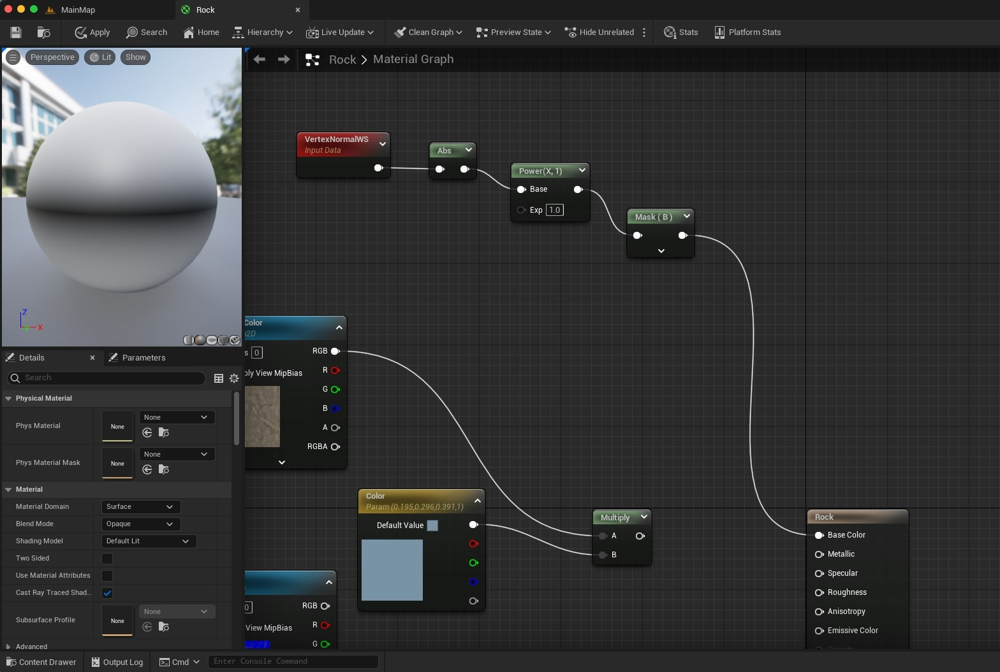

# Snowy Rock Triplanar Shader

Implemented with Triplanar Projection and Normals Orientation in **Unreal Engine 5.1.0**

## Screenshots

### Table of Content
- [Implementation](#implementation)
  - [Model Meshes](#model-meshes)
  - [Setup Scene](#setup-scene)
  - [Import Textures](#import-textures)
  - [Rock Material](#rock-material)
    - [Basic Rock](#basic-rock)
    - [Triplanar Projection Material](#triplanar-projection-material)
      - [Normal Masking](#normal-masking)
      - [TriplanarProjection Material Function](#triplanarprojection-material-function)
  - [Material Instances](#material-instances) 
  - [Snow Material](#snow-material)
  - [Snowy Rock Material](#snowy-rock-material)
    - [Snow and Rock Material Functions](#snow-and-rock-material-functions)
    - [Masking Roughness](#masking-roughness)

### Resources

- [Unreal Engine Materials Course by Timothy Trankle](https://www.udemy.com/course/unlocking-the-unreal-engine-material-editor)
- [Rock Texure](https://3dtextures.me/2022/03/03/rock-044/)
- [Snow Texture](https://3dtextures.me/2018/02/27/snow-002/)

## Implementation
### Model Meshes

- Model Meshes in Blender for the Rocks and the Ground.
- Ensure Normals are pointing to the right direction.

- Export as FBX and then import into Unreal Engine.
  

### Setup Scene

- Set the terrain and the rocks.

### Import Textures

### Rock Material
#### Basic Rock

- Implement a basic material using each of the textures for the corresponding property in the shader.

#### Triplanar Projection Material

- Use the **World Position** vector to sample the texture 2D, using the plane coordinates as if they were UV coordinates.
- Using the Red and Green channels means using the X,Y plane, thus projecting from the Z direction (Up, Down).
- This projection doesn't depend on object scale, UV maps, or anything.

- Repeating the process for all the 3 dimensions gives us the 3 projections we need.

##### Normal Masking

- To blend together the 3 projections, we need to use the normals directions.
- Getting the absolute value of the Blue coordinate of the Normals, gives us a mask to blend in the Z projection.
- Using a power function we make the blending band smoother.

- Multiplying each mask to the corresponding projection, then blending them all together by adding the colors, gives us the triplanar projection.

##### TriplanarProjection Material Function

- Extracting a set of nodes into a sub graph means creating a **Material Function**.
- This function has inputs and outputs.
- We can then reuse this in other materials.
- In the main **Triplanar Surface** **Material**, we now use the **Triplanar Projection** **Material Function** for each of the texures.

### Material Instances

- By making instances of a base material, we just change the parametrized textures and values.
- Make a material instance of the Triplanar Surface Material, to implement the Rock Material Instance.

### Snow Material

- Implement a new **Material** using the **TriplanarProjection** **Material Function**.
- Change the light model to **Subsurface**, for subsurface scattering.
- The **Subsurface **Color represents the subsurface scattering color.
- **Opacity** will dictate how much subsurface scattering will happen.

### Snowy Rock Material
#### Snow and Rock Material Functions

- Implement two **Material Functions** that will output **MakeMaterialAttributes** for both the **Snow** and **Rock** **Materials**.

#### Masking Roughness

- Use a texture to clamp values of 0,1 based on the threshold desired for the amount of snow.

- Mask again, this time using the Blue channel of the vertex normal, to just get the sides that are pointing up in world space.

- Use a height map to make the transition more natural, following the shapes of the texture.

- Multiply all these masks together to get the final mask used to blend the two **Material Properties**.

- Final result.

